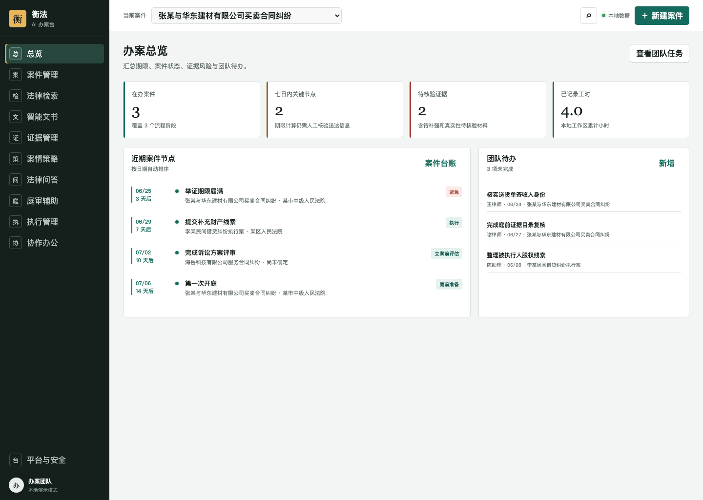
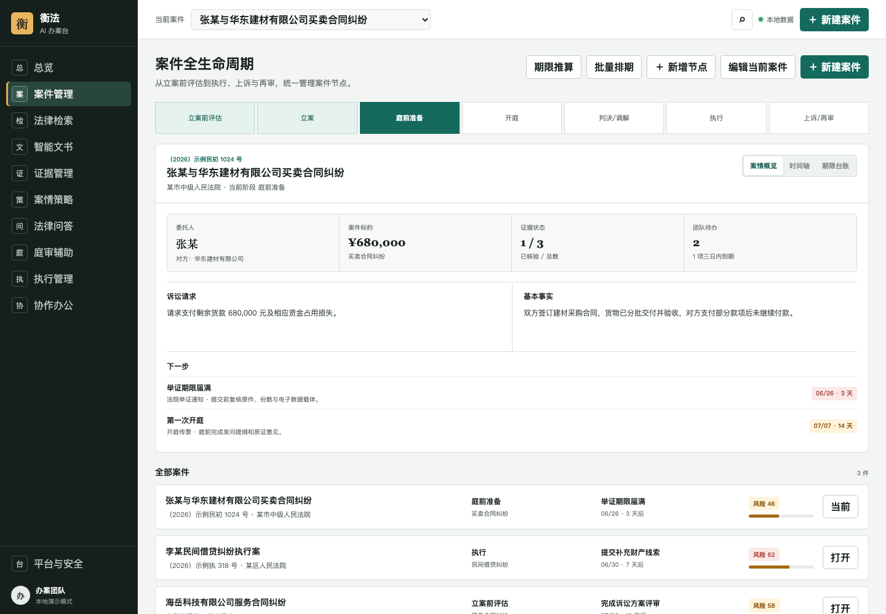
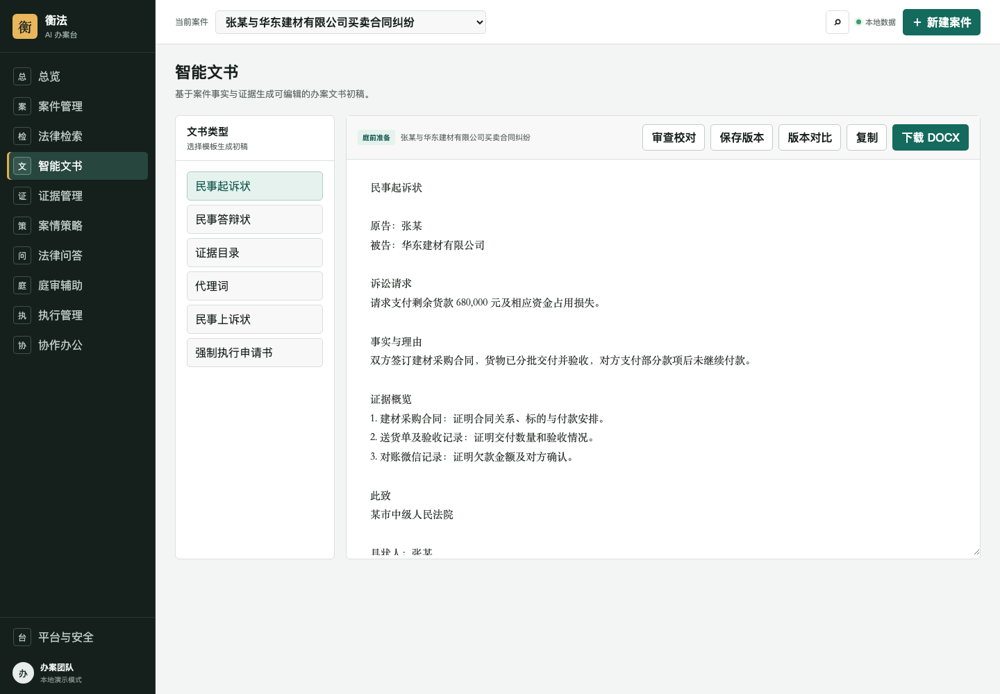
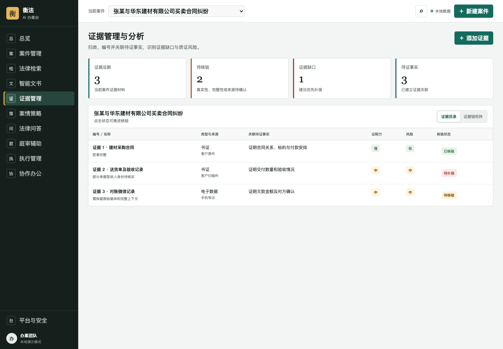

# 衡法 AI 办案台

根据《民事诉讼 AI 办公软件框架-概要》实现的民事诉讼 AI 办案工作台。后端使用零第三方依赖的 Node.js 与 SQLite（含内置 FTS5 全文检索），并保留直接打开 HTML 的本地演示模式。文字抽取在本机完成、数据不出本地：默认优先使用 Python（PyMuPDF/python-docx）加速器以获得最佳中文 PDF/DOCX 效果，未安装时自动回退到内置的零依赖 Node 抽取（图片 OCR、DOCX、文本、数字 PDF 文本层）。

## 界面预览

> 以下为本地演示模式截图（内置样例数据）。可用 `bash scripts/screenshots.sh` 重新生成至 `docs/screenshots/`。

| 办案总览 | 案件全生命周期 |
|---|---|
|  |  |
| **智能文书** | **证据管理与分析** |
|  |  |

## 已实现模块

- 案件全生命周期台账与关键节点提醒；总览仪表盘**一屏汇总跨案同日庭审冲突与全局逾期节点**，可点击直达对应案件时间轴
- 案件档案、事实摘要、程序时间轴和期限来源台账，并对时间轴自动提示**逾期/临近/同日多项待办/跨案庭审冲突**
- **送达日期期限推算**：按送达次日起算、末日遇**法定节假日/周末顺延**（节假日表由服务端**集中维护**——管理员在「平台与安全」页更新即对全员生效，2025 为准确数据、2026 为待核验示例，含调休上班日），自动计算上诉（判决 15 日/裁定 10 日）、答辩（15 日）、举证（可改）等截止日；并支持**按受理/应诉通知批量排期**——一次把答辩、管辖异议、举证（及开庭传票日期）多个节点一并写入程序时间轴
- 基于 SQLite FTS5/BM25 的真实法律检索（CJK 双字分词），开箱内置条文级样例语料并支持导入正式法源
- 检索增强问答：从工作区法源库召回片段，给出带可核验引用的抽取式回答
- 起诉状、答辩状、证据目录、代理词、上诉状和执行申请书生成，并一键导出为 DOCX（零依赖、Word/WPS 可打开）
- 文书占位符、主体信息、法源和未核验证据自动审查
- 证据编号、分类、待证事实关联、核验状态与证据链矩阵
- 争议焦点、证据缺口与风险路径分析；**类案检索 + 裁判倾向参考**（BM25 召回相似裁判要旨，启发式聚合支持/部分支持/驳回占比，仅供参考、不输出胜败概率）
- 庭前清单、发问提纲、质证和辩论要点生成
- **庭审语音转写**：本地离线转写庭审录音（可选 faster-whisper / 自定义引擎，数据不出本机）或手工导入笔录（SRT/VTT/「说话人：内容」/纯文本），结构化为带说话人与时间的分段，并可选生成**庭审小结**（争议焦点 / 自认 / 质证 / 待跟进，本地启发式或 Claude，强制附依据）
- 执行进度与财产线索台账
- 团队任务、工时和文书版本记录；**案源/客户（CRM）管理**与**案件归档及归档全文检索**（归档案件自动从办案列表与案件选择器隐藏，可按名称/案号/当事人/案由即时检索并一键复原）
- **Word / WPS 文书助手插件**（Office.js 任务窗格）：在 Word / WPS 内登录同一工作区，生成诉讼文书插入光标处、插入带依据的法律问答、校验选中文本的法条引用与事实依据
- 本地存储、脱敏、审计和来源要求的配置界面
- 关键节点、证据、文书生成和导出的操作审计台账
- SQLite 服务端持久化、HttpOnly 会话、CSRF 防护和角色权限
- 管理员、律师、助理、当事人四类角色及案件访问范围
- 受权限保护的案件文件上传、SHA-256 校验与本地 OCR
- PDF、DOCX、图片和文本材料的文字提取、预览及重新处理

## 运行

### 服务端模式

建议使用 Node.js 22 或更高版本。首次运行前可设置管理员账号：

```bash
export HENGFA_ADMIN_EMAIL="admin@example.com"
export HENGFA_ADMIN_PASSWORD="请设置至少10位的强密码"
npm run dev
```

然后访问 `http://127.0.0.1:4173`。未设置环境变量时，开发环境初始账号为 `admin@hengfa.local`，初始密码会输出在终端；首次登录后应立即修改。

SQLite 数据默认保存在 `data/hengfa.db`。可用 `HENGFA_DATA_DIR` 指定私有数据目录。

案件文件保存在数据目录下的 `uploads/`，不会通过静态 URL 暴露。文字抽取分两条路径，均在本机完成：

- **图片 OCR**（两条路径都需要）：`brew install tesseract` 并安装中文识别包 `chi_sim`/`chi_tra`（`brew install tesseract-lang`，或将 `chi_sim.traineddata` 放入 tessdata 目录）。
- **Python 加速器（可选，推荐）**：`python3 -m pip install PyMuPDF python-docx`，用于稳健处理中文 PDF（含扫描件内置栅格化）与 DOCX。
- **零依赖 Node 兜底（默认自动启用）**：未安装 Python 时，由内置 `ocr.mjs` 处理图片 OCR、DOCX、文本与数字 PDF 文本层；扫描件 PDF 需安装 Python 或 `poppler`（`brew install poppler`，提供 `pdftoppm`）。

可通过 `HENGFA_PYTHON_BIN`、`TESSERACT_BIN` 指定可执行文件，或用 `HENGFA_DISABLE_PYTHON=1` 强制使用零依赖路径。`/api/ocr/capabilities` 会返回当前实际可用的引擎与能力。

### 庭审语音转写（本地离线，可选）

庭审录音转文字同样遵循「可选本地引擎 + 零依赖兜底」：**默认无引擎时**只提供笔录手工导入与结构化，不会上传任何音频。启用本地离线转写有两种方式：

```bash
# 方式一：Python + faster-whisper（首次运行按需下载模型，之后离线）
pip install faster-whisper
# 可选：export HENGFA_ASR_MODEL=small   # tiny/base/small/medium/large-v3
# 可选：export HENGFA_ASR_LANG=zh

# 方式二：自定义命令行引擎（如 whisper.cpp），约定「接受音频路径、stdout 输出文本」
export HENGFA_ASR_CMD="/path/to/whisper-cli ..."
```

音频与转写全过程在本机完成；用 `HENGFA_DISABLE_ASR=1` 可强制走手工导入。`/api/hearing/capabilities` 返回当前可用引擎。**庭审小结**默认本地启发式摘录；仅当启用 Claude 基座时才会把笔录文本发送到 Anthropic 生成（强制附「（依据：发言N）」，失败回退本地）。

### Word / WPS 文书助手插件（Office.js 加载项）

`plugin/` 下是一个 Office.js 任务窗格加载项，把衡法能力嵌入 Word / WPS：登录同一工作区后，可在文档光标处**生成诉讼文书**、插入**带依据的法律问答**，并**校验选中文本**的法条引用与事实依据（复用服务端 `/api/documents/generate`、`/api/legal/answer`、`/api/documents/verify`）。窗格与服务端**同源**，沿用既有会话 Cookie 与 CSRF。

侧载步骤：

1. **以 HTTPS 暴露服务端**（Office/WPS 加载项强制 HTTPS）：本地可用 `npx office-addin-dev-certs install` 生成证书并配 TLS 反向代理，或部署到 HTTPS 域名。
2. 将 [`plugin/manifest.xml`](plugin/manifest.xml) 中所有 `https://localhost:4173` 替换为你的实际 HTTPS 地址。
3. **Word**（桌面/网页）：插入 → 我的加载项 → 上传我的加载项 → 选择 `manifest.xml`；功能区「开始」选项卡出现「衡法 · 文书助手」。
4. **WPS**：在支持 Office.js 加载项的版本中按其加载项管理导入同一 `manifest.xml`。

加载项静态文件由衡法服务端在 `/plugin/*` 提供，并使用仅放行 Office.js 官方 CDN 的专用 CSP。

### 法源库与官方法源接入

首次启动时，约 60 条条文级**样例语料**写入 `legal_sources` 与 FTS5 索引，检索/问答即可使用。管理员可在「智能法律检索」页以三种方式扩充：

- **单条导入**：「＋ 导入正式法源」粘贴经核验的正式文本。
- **批量导入 JSON**：「批量导入 JSON」上传 `{ "sources": [ { title, authority, level, status, effectiveDate, sourceUrl, text } ] }`，调用 `POST /api/legal/import`。
- **官方库抓取脚本**（本机运行，需外网）：

  ```bash
  node scripts/fetch_flk.mjs "买卖合同" --size 10 --out data/legal-import.json
  # 再在「批量导入 JSON」上传 data/legal-import.json；或直接导入到本地服务：
  HENGFA_IMPORT_URL=http://127.0.0.1:4173 HENGFA_ADMIN_EMAIL=... HENGFA_ADMIN_PASSWORD=... \
    node scripts/fetch_flk.mjs "买卖合同" --import
  ```

  脚本从国家法律法规数据库（flk.npc.gov.cn）抓取并整理条文，解析层（`htmlToText`/`mapFlkLevel`/`normalizeFlkSource`）有单元测试覆盖；**因官方接口可能调整，导入的 status 一律标记为「有效性待核验」，须人工核对现行文本与效力**。

### 可选 Claude 生成式能力（AI 中台基座模型）

本系统统一指定 **Claude 为生成式基座模型**（默认 `claude-opus-4-8`），服务端所有大模型能力——法律问答、案件事实抽取、裁判倾向综述、庭审小结——都经同一个 `claudeChat` 客户端调用，仅以检索片段、案件材料或庭审笔录为唯一依据并强制附引用。**默认关闭以贯彻本地优先**，未启用时各能力走本地（抽取式 / 启发式）结果。如需启用：

```bash
export HENGFA_LLM=claude
export ANTHROPIC_API_KEY="sk-ant-..."
# 可选：export HENGFA_LLM_MODEL=claude-opus-4-8
```

启用后相关问题与检索片段 / 案件材料会发送到 Anthropic；任何调用失败都会自动回退到本地结果（响应中的 `generatedBy` / `extractedBy` 字段标明来源）。

### 本地演示模式

在文件管理器中打开 `index.html`，或直接在浏览器中访问：

```text
file://***/civil_litigation/index.html
```

本地演示模式的数据保存在浏览器 `localStorage`，不启用登录与服务端权限，仅用于界面体验。

### 测试

```bash
npm test
```

### 打包为桌面 / 移动应用

可打包为 macOS/Windows 桌面应用(Electron,全功能)与安卓本地演示 APK(Capacitor),并通过 GitHub Actions 按 tag 自动构建发布。详见 [BUILD.md](BUILD.md)。核心代码保持零依赖,打包工具隔离在 `desktop/`、`mobile/` 子目录。

## 当前边界

本版本用于验证产品流程和交互。**内置法律语料为条文要点归纳样例**，具体条号、现行文本、效力状态、法院要求和案件事实必须由办案人员回到正式法源核验，不能作为正式法律意见。

各能力当前形态：

- 法律检索 / 问答：服务端模式下已接入真实的 SQLite FTS5/BM25 检索与带引用的问答（`/api/legal/search`、`/api/legal/answer`）。默认问答为「检索 + 抽取式摘录 + 引用」；配置 `HENGFA_LLM=claude` + `ANTHROPIC_API_KEY` 后改为以检索片段为唯一依据的 Claude 生成式回答（强制附引用，失败自动回退），默认关闭以贯彻本地优先。法源库可经单条 / 批量 JSON / 官方库抓取脚本扩充，并支持编辑效力状态与元数据，**变更自动留痕**（谁、何时、由何值改为何值，可查看变更记录）。检索**默认排除已废止/已失效/已修改/尚未生效**法源（可开关显示）；引用校验会把引用了**失效法源**的文书标记告警，仪表盘还会**反查并提示哪些已生成文书引用了失效法源**，可一键**在文书内高亮定位引用段落**，并**直接在弹窗内检索现行有效法源替换、存为新版本**（替换后该告警自动消除）。替换弹窗会**按失效法源主题自动预填关键词并即时检索现行有效候选**，免手动输入。法源可设「**有效期至**」。后台**定时任务**(默认每 12 小时，无需登录)统一扫描并去重生成多类提醒——**法源到期、逾期节点、临近期限、跨案庭期冲突、逾期/临近协作任务**——写入**通知中心**(顶栏铃铛 + 未读数即时可见，按类型分组折叠便于浏览)，并可选配置 `HENGFA_REMINDER_WEBHOOK` 主动 POST 到外部:payload 含工作区**总日报 `digest`** 及**按收件人个性化的 `deliveries`**(每位订阅外部渠道的成员一封,只含其关注类型与提前窗口内的提醒,便于直接群发邮件/企业微信/钉钉)。外部投递失败会**留痕并在下次扫描自动重发**(`webhook_outbox`，超过 `HENGFA_WEBHOOK_MAX_ATTEMPTS`(默认 5)标记 failed，管理员可在「平台与安全」页**可视化查看投递记录**(配置状态、待发/失败数、各条状态与失败原因),并一键**刷新 / 重试待发**)。超过保留天数(`HENGFA_NOTIF_RETENTION_DAYS`，默认 30)的**已读**通知与已发投递记录由定时任务自动清理,避免无限堆积(未读与失败记录保留)。每位成员可在「提醒偏好」自定义**临期提前天数、关注的提醒类型、接收渠道**(站内/外部)，通知中心按个人偏好过滤，并可「查看日报」按未读提醒生成可复制的汇总。每条通知可**点击直达**对应对象——逾期/临期/庭期冲突跳到案件时间轴、法源到期跳到法源维护并打开编辑（点击同时标记已读）。
- 文书生成与文书 Agent：`generateDocument` 基于已录入信息拼装初稿（起诉状/答辩状/代理词/证据目录会**内嵌「证据链与补强提示」**，由证据矩阵自动列出待证事实的核验比例与补强建议），并可导出为结构化 DOCX。「智能文书」页（服务端模式）提供：
  - **事实抽取**（`POST /api/documents/facts`）：从案件已上传材料抽取带来源与类型标注的候选事实，可一键插入草稿；带日期的事实自动汇总为**升序排列的案件时间线**，并可**一键写入案件「程序时间轴」**（caseEvents，去重，过去=已完成/将来=待办理）；支持可选 Claude 结构化抽取（默认关，失败回退本地）。
  - **引用校验**（`POST /api/documents/verify`）：法条引用回 FTS5 法源库核验，金额/当事人等关键事实回案件材料与证据核验，标注「已匹配/未核验」「有依据/缺依据」；有依据项**标注命中的来源文件**，未核验法条可**一键跳转法律检索**、缺依据金额/当事人可**一键跳转证据/材料页**补充。
  - **版本对比**：「保存版本」对草稿做内容快照，「版本对比」以行级 LCS diff 对比**任意两个版本（含当前草稿）**的增删差异。
- 案情策略：`calculateStrategy` 为本地启发式风险参考，不输出确定性胜败结论。「检索类案」（`POST /api/strategy/tendency`）按案件案由与关键事实经 BM25 召回相似**裁判要旨样例**，本地聚合「支持 / 部分支持 / 驳回」占比作为**裁判倾向参考**；配置 Claude 后附带以召回片段为唯一依据、强制标注「（依据：类案N）」的倾向综述（失败回退本地）。**内置类案为要点归纳样例、不对应真实案号**，正式类案须回到中国裁判文书网核验。
- 数据：核心业务数据以工作区 JSON 形式存入 SQLite；案件文件、OCR 文本、法源检索片段、法源变更留痕、节假日表、提醒通知、提醒偏好与 webhook 投递记录已拆分为独立结构化表（`case_files`、`legal_sources`、`legal_chunks_fts`、`legal_source_revisions`、`holiday_calendars`、`notifications`、`notification_prefs`、`webhook_outbox`）。

## 文件

- `index.html`：应用结构
- `styles.css`：响应式工作台样式
- `app.js`：数据模型、视图、交互逻辑与零依赖客户端 DOCX 导出
- `server.mjs`：零依赖本地服务器（认证、权限、状态同步、文件、FTS5 检索）
- `legal-corpus.mjs`：约 60 条条文级法律检索样例语料（首次启动写入 FTS5）
- `precedent-corpus.mjs`：约 17 条类案裁判要旨样例语料（首次启动写入 `precedent_fts`，用于类案检索与裁判倾向参考）
- `holidays.mjs`：法定节假日默认数据（首次启动播种，之后由管理员经 `/api/holidays` 集中维护）
- `ocr.mjs`：零依赖本地文字抽取兜底（图片 OCR、DOCX、文本、数字 PDF）
- `transcribe.mjs`：庭审语音转写（本地引擎探测、音频转写、零依赖笔录 SRT/VTT/分段解析）
- `scripts/transcribe.py`：可选 faster-whisper 本地离线转写加速器
- `document-templates.mjs`：文书模板纯函数（Web 应用与 Word/WPS 插件共享，经 `/api/documents/generate`）
- `plugin/`：Word/WPS 文书助手 Office.js 加载项（任务窗格 + 清单 + 命令页 + 图标）
- `scripts/extract_text.py`：可选 Python 抽取加速器（PyMuPDF + python-docx）
- `scripts/fetch_flk.mjs`：官方法源库（flk.npc.gov.cn）抓取与导入脚本（本机联网运行）
- `tests/`：认证、权限、版本同步、前端权限、RAG 检索、批量导入、本地抽取、文书 Agent（事实抽取/引用校验）、类案裁判倾向、CRM/归档、庭审语音转写与 Word/WPS 插件（模板/生成端点/窗格服务）回归测试
- `民事诉讼AI办公软件框架-概要.pdf`：原始产品概要
